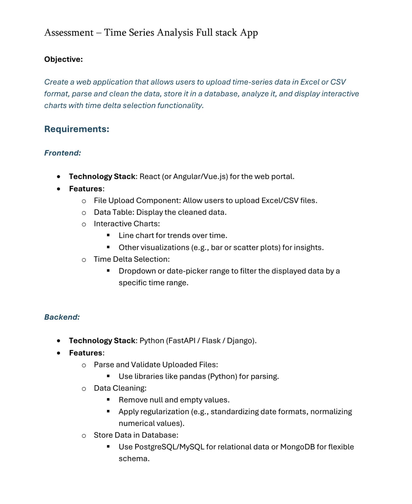
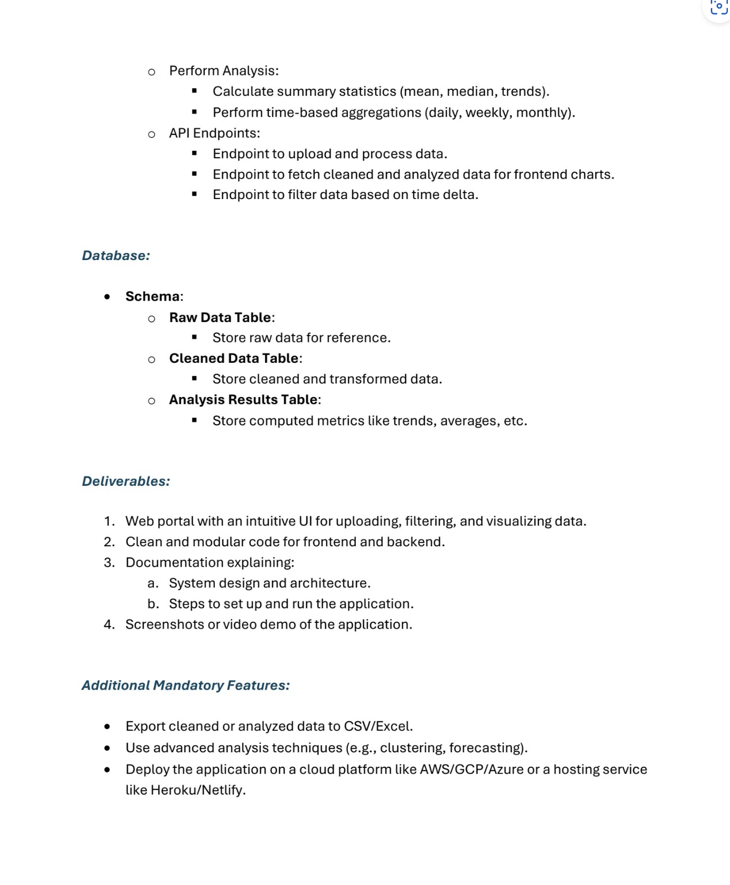

# time-series-analysis
A web application that allows users to upload time-series data in Excel or CSV format, parse and clean the data, store it in a database, analyze it, and display interactive charts with time delta selection functionality

## Requirements as obtained from I forgot where




## Pre-requisites 

- Make sure you have uv installed [https://docs.astral.sh/uv/](https://docs.astral.sh/uv/)
- Run this -
```sh
uv sync -p 3.12
```